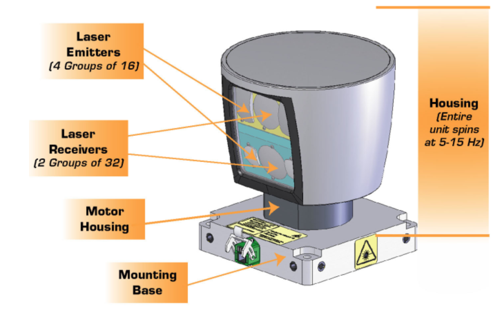

# My personal learning diary(or learning notes) about Perception and sensor fusion 
Some of the notes are based on the this [repo](https://github.com/fanweng/Udacity-Sensor-Fusion-Nanodegree).

my_project.md: About the projects.

lecture notes: lecture notes from this [repo](https://github.com/fanweng/Udacity-Sensor-Fusion-Nanodegree).

## Basic introduction

All sensors have their own different types of strengths and weeknesses. Here are some of them: Lidar, Camera, Radar, GNSS, IMU, Speedometer, Odometer, Laser range finders,Thermal cameras, Ultrasonic

Here are the three most impotant ones for self driving.

1. Lidar
2. Radar
3. Camera

Before doing sensor fusion, we need to know how to process raw lidar/radar/camera data separately.

## Lidar

### I. Lidar Sensors
well known brand: Velodyne

- Rotating lidars: rotating sensors to have a 360-degree of the environment
- Reflecting lidars: using mirrors to scan the laser beams
- Solid-state lidars: using phased array type of principle

- Mount position
    * rooftop: farthest field of view
    * Also front, back and side: coverage for the blindspot of rooftop lidars

- Resolution
    * more layers of laser in the vertical field of view, to avoid an object hiding between the gap of two layers

##### Question:
VLP Sensor Specifications: 

How many Lidar Points?:Approximately how many points does an HDL 64 collect every second given these specs? Assume an average update rate of 10Hz.

##### Answer:

$360/0.08\times64\times 10=2880000$

### II. Point Clouds

#### 1. Point Clouds
A point cloud is a set of all lidar reflection points measured. Each point is one laser beam reflected from an object.

#### 2. Point Clouds Data file

PCD of a city block with parked cars, and a passing van. Intensity values are being shown as different colors. The big black spot is where the car with the lidar sensor is located.

 

- A PCD file contains a list of Point Cloud Data, with every point in the format of `(x, y, z, I)`
    * `(x, y, z)` is the Cartesian coordinates, telling us the location of the reflected surface on the object. And this coordinate system is right-handed .
        + `x` pointing towards the front of the car
        + `y` pointing to the left of the car
        + `z` pointing to the vertical up above the car
    * `I` is the signal strength of the laser related to the reflective properties of the material

##### Question:
While scanning with a VLP 64, a laser signal from the top layer takes 66.7 ns to be emitted and received again. The laser is emitted at a -24.8 degree incline from the X axis and horizontally travels along the X axis. Knowing that the speed of light is 299792458 m/s, what would be the coordinates of this laser point (X,Y,Z) in meters?
##### Answer:
$(9.08, 0, -4.19)$ Will explain the calculation later.

#### 3. Point Cloud Library (PCL) 
Point Cloud Library (PCL) is an open source library for processing the PCD file. It helps doing filtering, segmentation, and clustering of point clouds, rendering work, etc. Some documentation for PCL can be found [HERE](https://pointclouds.org/).

            
            

## Camera
## Radar

In Sensor Fusion, by combining lidar's high resolution imaging with radar's ability to measure velocity of objects we can get a better understanding of the surrounding environment than we could using one of the sensors alone.
